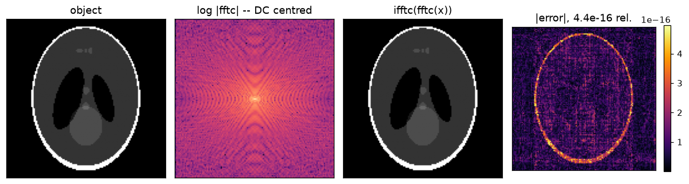
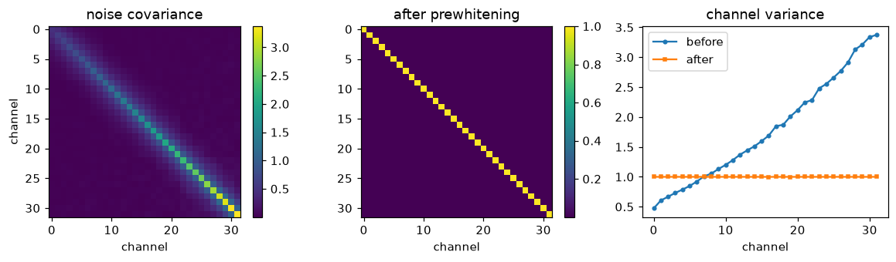
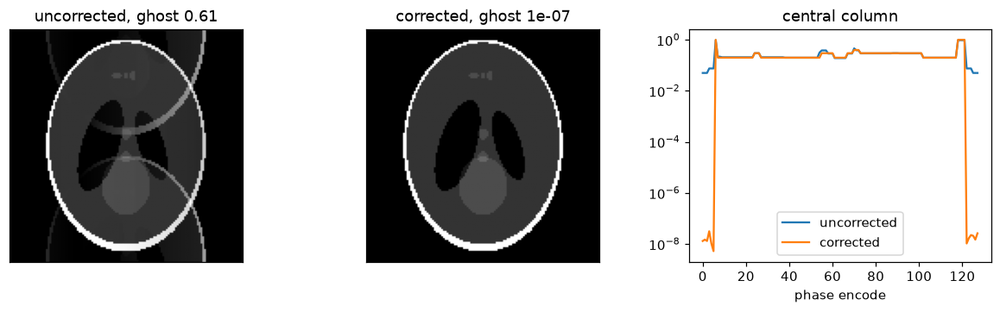
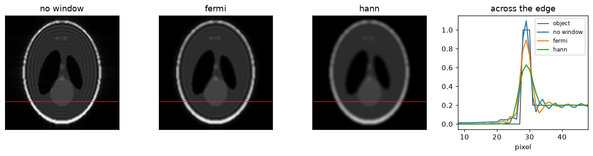
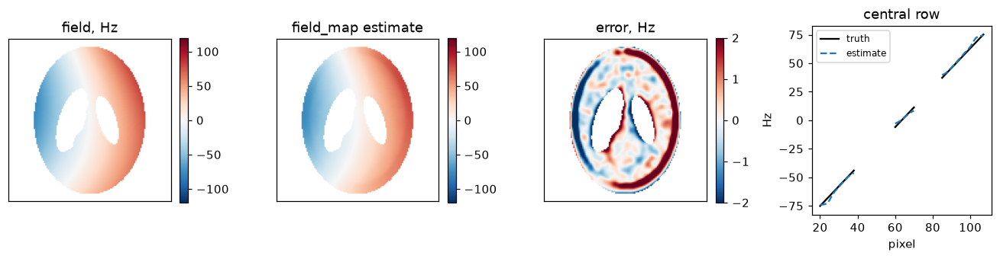
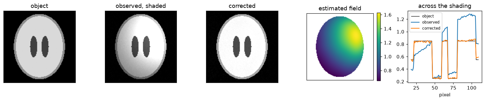

# mrutils

The MRI pre- and post-processing steps that every reconstruction needs and none
of them owns: the centred Fourier convention, the receive-array corrections
that happen before a solve, the EPI readout corrections, and the shading and
apodization that happen after.

[](https://github.com/FiRMLAB-Pisa/mrutils/actions/workflows/test-ci.yml)
[](https://codecov.io/gh/FiRMLAB-Pisa/mrutils)
[](https://pypi.org/project/mrutils/)
[](LICENSE)

Everything is array in, array out: Torch tensors keep their device and NumPy
arrays stay NumPy, so the same step runs on a scanner host and on a
workstation without either having to convert to reach it. Torch is an extra,
not a dependency.

The package is deliberately small, and it is the base of a family of MRI
packages rather than a reconstruction of its own — no solvers, no physics
operators, no sensitivity estimation. Each function below has a notebook that
runs it against something known: a round trip, a covariance, a phase that was
impressed on purpose, a field with a closed form.

## Install

```bash
pip install mrutils                # numpy + scipy
pip install mrutils[torch]         # keep tensors on their device
pip install mrutils[bias]          # N4 bias-field correction
pip install mrutils[all]
```

## Usage

### The Fourier convention

`ifftshift -> fft(norm="ortho") -> fftshift`, stated once so nothing downstream
re-derives the shifts. Cropping and padding are about the same centre, so
neither moves the object.

```python
import mrutils as mru

kspace = mru.fftc(image)  # last two axes by default
plane = mru.ifftc(volume, axes=-1)  # decouple a readout
coarse = mru.resize_centered(kspace, (128, 128))
readout = mru.remove_readout_oversampling(digitised, 256)
```



[`examples/fourier.ipynb`](examples/fourier.ipynb)

### Before the solve

A noise-only scan measures what the array's coupling did to the noise;
prewhitening is the change of basis that makes its covariance the identity.
Compression then keeps the leading virtual channels, which is what makes a
48-channel scan solvable at the size of an 8-channel one.

```python
whitened = mru.noise_prewhiten(kspace, noise_scan, coil_axis=0)
compressed, basis = mru.coil_compress(whitened, 8)  # or 0.95 of the energy
```

`coil_compress` returns the basis as well as the data, so the acquisitions that
arrive after a calibration — and the sensitivities they are solved against —
are compressed the same way.



[`examples/coils.ipynb`](examples/coils.ipynb)

### EPI

Reversing a readout does not reverse the delays it was played through, so a
line read backwards carries a phase its neighbours do not, and that is the
Nyquist ghost. A blip-nulled navigator measures the phase directly. Ramp
sampling is a separate problem and a change of basis rather than an
interpolation: the readout is band-limited, so samples taken anywhere determine
it everywhere.

```python
phase = mru.estimate_epi_phase([plus, minus, plus])
lines = mru.correct_lines(train, phase)  # [(data, is_reversed), ...]

operator = mru.epi_ramp_operator(sampled_k, uniform_k, support=matrix)
on_grid = readout @ operator.T
```



[`examples/epi.ipynb`](examples/epi.ipynb)

### Apodization

A window trades resolution for a point spread function without side lobes.
Fermi sets its radius and its transition width separately; Hann is the raised
cosine over the whole radius. Both are radial in normalized k, so an
anisotropic matrix gets an ellipsoid matched to its own grid rather than a
sphere that clips one axis first.

```python
apodized = mru.apodize(kspace, kind="fermi", radius=0.9, width=0.05)
apodized = mru.apodize(kspace, kind="hann")
window = mru.fermi_window((256, 256))
```



[`examples/apodization.ipynb`](examples/apodization.ipynb)

### After the solve

`field_map` takes the angle of the product of consecutive echoes, so a receive
phase common to every echo cancels; the echo spacing sets the range it can
carry. `bias_field_correct` is N4 on the coil-combined magnitude.

```python
offset_hz = mru.field_map(echo_images, echo_times)
corrected = mru.bias_field_correct(magnitude)  # needs [bias]
```





[`examples/field_map.ipynb`](examples/field_map.ipynb) ·
[`examples/bias_field.ipynb`](examples/bias_field.ipynb)

## References

The package this one takes its scope from, the implementations it calls, and
the methods it implements.

- **ismrmrd-python-tools** —
  <https://github.com/ismrmrd/ismrmrd-python-tools>. The same idea: the
  reconstruction steps that are common to everyone, as plain array functions.
  This package keeps that scope and drops the ISMRMRD file format, so nothing
  here needs a data model to be called.
- **SimpleITK** — <https://simpleitk.org/>. Its
  `N4BiasFieldCorrectionImageFilter` is what `bias_field_correct` calls.
- Roemer PB, Edelstein WA, Hayes CE, Souza SP, Mueller OM. *The NMR phased
  array.* Magn Reson Med 1990;16:192-225. The noise covariance and the
  whitening built from it.
- Buehrer M, Pruessmann KP, Boesiger P, Kozerke S. *Array compression for MRI
  with large coil arrays.* Magn Reson Med 2007;57:1131-1139.
- Bruder H, Fischer H, Reinfelder HE, Schmitt F. *Image reconstruction for echo
  planar imaging with nonequidistant k-space sampling.* Magn Reson Med
  1992;23:311-323. The odd/even phase correction and the ramp-sampling
  resampling.
- Tustison NJ, Avants BB, Cook PA, Zheng Y, Egan A, Yushkevich PA, Gee JC.
  *N4ITK: improved N3 bias correction.* IEEE Trans Med Imaging
  2010;29:1310-1320.

## Development

```bash
pip install -e .[dev]
bash scripts/format_and_lint.sh
pytest -q
```

The docstring examples run as part of the suite — they are the documentation,
and an example that has drifted is a broken one. See
[CONTRIBUTING.md](CONTRIBUTING.md).
